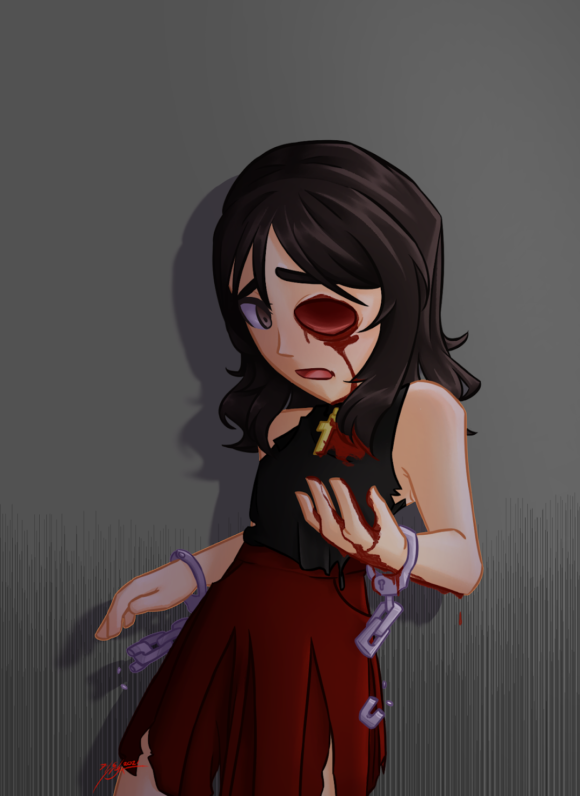

# Majo

Majo Majima is the Witch of Therapy. Her powers are healing — clean, comprehensive, and as far as anyone has been able to determine, without side effects. She heals people and it costs her nothing. This is, depending on how you look at it, either a gift or the cruelest possible arrangement.

She was in the car the night of the Crash. Abigail was in the car. She healed herself, because the body does what it can, and Abigail died anyway. There is no version of her powers that explains this or makes it right. She has spent the time since trying to find one.

She was 26 at the time of the Crash. She had been in a polyamorous relationship with Abigail Rodriguez and Sarah Florence — a relationship that was, by all accounts from those inside it, genuinely loving and genuinely complicated. Majo and Sarah had been partners before Abigail; they had broken up and stayed close in the specific way people do when they're too entangled to separate cleanly. Abigail was the center of gravity that kept all three of them in stable orbit. When Abigail died, the orbit broke.

She began operating under the name Sympathy. She has since dropped it. She goes by Majo now — her own name, no costume-name required, as if the refusal to perform heroism is itself a kind of stance. She wears it plainly. She heals people. She shows up.

She is in therapy because of her depression and her guilt, which are not the same thing but which live very close together. The guilt is specific: she wishes she could have saved Abigail. The depression is general: she has wished this so many times, and in so many ways, that it has become structural. Dr. Okafor does not let her conflate the two, and Majo does not always find this useful, and it is useful anyway.

She joined Therapy — the team — with Michelle and Jackson MacDuffie. This is not a coincidence so much as a convergence: they were all already in the same orbit, already dealing with what the Crash had made of them, and the logic of putting something formal around that felt less like a recruitment and more like an acknowledgment of what was already true.

She and Alice Brown (Rock Woman) fell in love. This happened slowly, which is the only way it could have happened for either of them — one who doesn't trust enough and one who trusts too much and has paid for it, finding their way toward something that actually holds. Majo proposed. Alice said yes. They are engaged.

---

## The Solo Run

The campaign Dangerous and Twilight ran against Majo was methodical and sustained. Diana Rice's mind control and Sarah's involuntary necromantic connection to Abigail were combined into something precisely calibrated to what Majo loved most and had lost. The Abigail that Majo experienced during this period was not fully Abigail and not fully fabricated — which is what made it so effective. It was the genuine grief of one person weaponized by another, fed through the specific architecture of Majo's love.

She was only freed when Trinity Grace — Silenced Wren, who had not spoken aloud since the Crash — said something out loud for the first time. The first words Wren said were Abigail's name. Because Majo kept saying it, and someone needed to say it back in a way that was real.

After, Majo believed Sarah was rehabilitating. The pie was Sarah's gesture, and Majo accepted it, because she wanted it to be true.

She knew what the pie meant. That is the part she has to live with. She knew — not as evidence, not as proof, but in the way you know things you have known for years without needing them explained — that Sarah made things from scratch because her hands needed to be busy, needed the particular grounding of a kitchen, needed to feel like a person living in a home with people she loved. Sarah had always done this. The three of them had always done this. Majo recognized it the moment she saw the pie, recognized the specific domestic register of it, and let herself believe that recognition was reason enough to trust what she was being offered.

She let Sarah in. She set out plates. They ate together.

This is not stupidity. This is not naivety. Majo knew, at every level she had access to, that she was taking a risk. She chose to take it anyway, because the alternative — refusing, closing the door, insisting she was too smart to be moved by a pie — felt like the wrong kind of survival. The kind that keeps you safe by making you unable to be reached. She did not want to be that. She still does not want to be that. Even after everything.

It was not true. The gesture was real. The person making it was no longer fully the person Majo remembered. Both things are true at once, and Majo has spent a long time sitting with the fact that being right about the first one did not protect her from the second.

---

  
<b>Content Warning: Eye Trauma</b>

    

She lost her eye. The intimacy of it is the part she does not talk about. Not the injury — injuries have a clinical simplicity that makes them easier to hold. What she does not talk about is the closeness. How well Sarah knew how to be close to her. How the geography of her trust was not something she had to teach Sarah, because Sarah had already learned it, years ago, in a different life that turned out not to be as over as either of them thought.

Majo has not stopped wishing she had been right about Sarah. She has also not stopped knowing she was wrong. These are not in contradiction. She has checked.

She is Rock Woman's fiancée. She will be her wife. This is the part of the story that holds.

Alice cannot have children. The anomaly that makes her what she is — genetic and mystical at once, inextricable — precludes it. This is not something Majo can heal, because it is not damage. It is structure. It is Alice. Majo has sat with this, and she has sat with her own feelings about it, and what she has arrived at is something she did not expect: she is not grieving a future she had planned. She is grieving, a little, on Alice's behalf — for all the centuries Alice has carried this in the specific silence of someone who stopped letting it matter. Majo is a healer who cannot fix this, loving someone who has long since stopped needing it fixed. She thinks that might be the most honest version of love she has ever been asked to practice.

She and Hardwire are poker buddies. Majo shows up to the game. Nadia keeps letting her. They don't talk about being powered people at the table. This arrangement suits both of them for different reasons.

Majo does sidework outside of Therapy — quiet interventions, unglamorous, off any official record. She once left the door open for Nadia to come along, and Nadia came. Nadia did not enjoy it. The situation got to her in the specific way high-stakes situations get to her, and her powers responded accordingly, and she spent most of the time trying to manage that rather than being useful. Majo thanked her anyway, which Nadia received poorly. She showed up to poker the following week. Majo has not brought it up.

Majo does not think less of Nadia for not enjoying it. She thinks Nadia is someone who knows exactly who she is and what she wants and has committed to it with a consistency that most people can't manage. She respects this even when it means Nadia is sitting out. Especially, maybe, when it means that.
